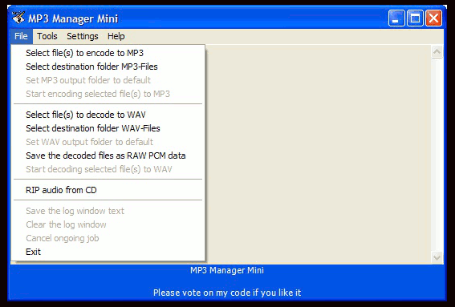



## MP3 Manager Mini

### Description

FEATURES: MP3 encoding, Create playlists using filter. Batch edit MP3 tags using filter. CD audio ripping with auto tagging. Auto add MP3 tags, integrated with CDDB, and some more useful stuff;-)
 
### More Info
 

             |
---                |---
**Submitted On**   |2011-02-09 20:00:50
**By**             |[Jan Andersson](https://github.com/Planet-Source-Code/PSCIndex/blob/master/ByAuthor/jan-andersson.md)
**Level**          |Intermediate
**User Rating**    |4.8 (19 globes from 4 users)
**Compatibility**  |VB 6\.0
**Category**       |[Sound/MP3](https://github.com/Planet-Source-Code/PSCIndex/blob/master/ByCategory/sound-mp3__1-45.md)
**World**          |[Visual Basic](https://github.com/Planet-Source-Code/PSCIndex/blob/master/ByWorld/visual-basic.md)
**Archive File**   |[MP3\_Manage221091972011\.zip](https://github.com/Planet-Source-Code/jan-andersson-mp3-manager-mini__1-74080/archive/master.zip)

